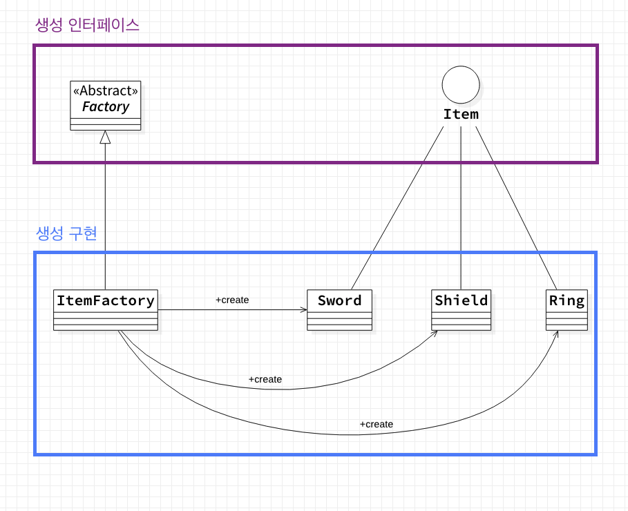

# 팩토리 메서드

### 의도

부모가 객체를 생성하기 위해 인터페이스를 정의(제공)하지만, 어떤 클래스의 인스턴스를 생성할 것인지 결정은 자식(서브) 클래스가 직접 내리도록 한다.

why?

- 객체 생성에 대한 `인터페이스` 와 `구현` 의 분리 → **시스템의 확장성 & 유지보수성 증가**
- 자식 클래스는 생성될 객체들의 유형을 자유롭게 변경이 가능
- 객체 생성에 필요한 과정을 템플릿 처럼 정해놓고 각 과정을 다양하게 구현할 수 있다.
→ 원하는 시점에 구체적으로 생성할 클래스를 유연하게 정할 수 있다.

생성의 인터페이스와 구현이 분리되어 있다. 즉, 인터페이스는 구현의 부분에 대해 전혀 모르고 있기 때문에 별도 패키지로 분리하여 개발이 가능하다는 것을 의미한다.

### 구현

두가지 방법이 있다.

1) Creator 클래스를 `추상 클래스`로 정의하고 정의한 팩토리 메서드에 대한 **구현은 제공하지 않는 경우**
→ 구현을 제공한 자식클래스를 반드시 정의해야 한다.
→ 예측 불가능한 클래스들을 생성해야 하는 문제가 생긴다.

2) Creator 클래스를 `구체 클래스`로 정의하고 팩토리 메서드에 대한 **기본 구현을 제공하는 경우다**.
→ Creator클래스가 팩토리 메서드를 사용하여 유연성을 보장 가능

### 팩토리메서드vs 추상팩토리

둘 다 팩토리 객체를 통해 구체적인 타입을 감추고, 객체 생성에 관여하는 패턴이라는 공통점이 있다.

공장 클래스가 제품 클래스를 각각 나누어서 느슨한 결합 구조를 구성하는 모습 또한 유사하다.

차이점을 살펴보자면,
팩토리 메서드 패턴은 ‘객체 생성 이후 해야 할 일의 공통점을 정의’하는데 초점을 맞춘다. 

추상 팩토리 패턴은 ‘생성해야 할 객체 집합 군’의 공통점에 초점을 맞춘다.

이 둘의 유사점과 차이점을 조합해서 복합 패턴을 구성하는 것도 가능

|  | 팩토리 메서드 | 추상 팩토리 |
| --- | --- | --- |
| 목적 | 구체적인 객체 생성 과정을 하위 또는 구체적인 클래스로 옮기는 것이 목적 | 관련 있는 여러 객체를 구체적인 클래스에 의존하지 않고 만들 수 있게 해주는 것이 목적 |
| 지원 | 한 Facotry당 한 종류 객체 생성 지원 | 한 Factory에서 서로 연관된 여러 종류의 객체 생성을 지원. (제품군 생성 지원) |
| 포커스 | 메소드 레벨에서 포커스를 맞춤으로써, 클라이언트의 ConcreteProduct 인스턴스의 생성 및 구성에 대한 의존을 감소 | 클래스(Factory) 레벨에서 포커스를 맞춤으로써 클라이언트의 ConcretProduct 인스턴스 군의 생성 및 구성에 대한 의존을 감소 |

### 결과

- 자식클래스에 대한 hook메서드를 제공
→ 팩토리 메서드를 통해 클래스 내부에서 객체를 생성하는 것이 객체를 직접 생성하는 것 보다 훨씬 응용성이 높다.
- 병럴적인 클래스 계통을 연결하는 역할을 담당한다.
→ 병럴적인 클래스 계통은 자신의 채김을 분리된 다른 클래스에 위임할 때 발생한다.

단점 : 기능의 확장이 필요할 때, 즉 객체가 추가될 때마다 규모가 커지고 작업할 메서드가 많아진다. (노가다 필요)

